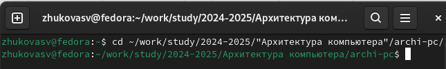
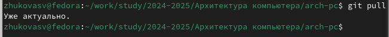
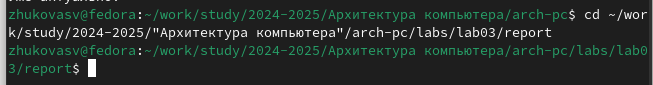
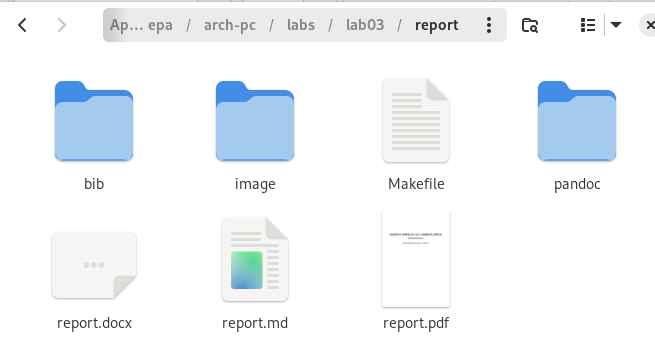
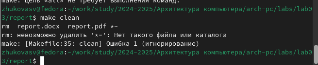
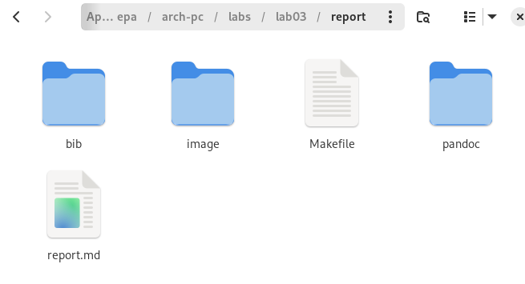
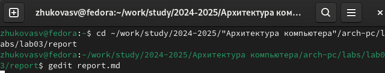
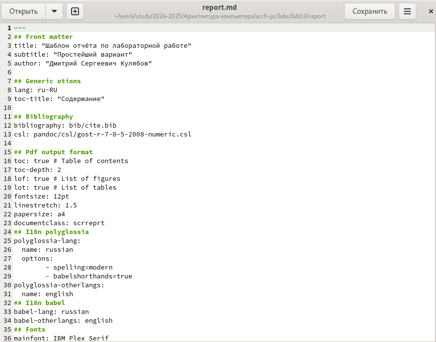

---
## Front matter
title: "Отчет по лабораторной работе №3"
subtitle: "Язык разметки Markdown"
author: "Жукова София Викторовна"

## Generic otions
lang: ru-RU
toc-title: "Содержание"

## Bibliography
bibliography: bib/cite.bib
csl: pandoc/csl/gost-r-7-0-5-2008-numeric.csl

## Pdf output format
toc: true # Table of contents
toc-depth: 2
lof: true # List of figures
lot: true # List of tables
fontsize: 12pt
linestretch: 1.5
papersize: a4
documentclass: scrreprt
## I18n polyglossia
polyglossia-lang:
  name: russian
  options:
	- spelling=modern
	- babelshorthands=true
polyglossia-otherlangs:
  name: english
## I18n babel
babel-lang: russian
babel-otherlangs: english
## Fonts
mainfont: IBM Plex Serif
romanfont: IBM Plex Serif
sansfont: IBM Plex Sans
monofont: IBM Plex Mono
mathfont: STIX Two Math
mainfontoptions: Ligatures=Common,Ligatures=TeX,Scale=0.94
romanfontoptions: Ligatures=Common,Ligatures=TeX,Scale=0.94
sansfontoptions: Ligatures=Common,Ligatures=TeX,Scale=MatchLowercase,Scale=0.94
monofontoptions: Scale=MatchLowercase,Scale=0.94,FakeStretch=0.9
mathfontoptions:
## Biblatex
biblatex: true
biblio-style: "gost-numeric"
biblatexoptions:
  - parentracker=true
  - backend=biber
  - hyperref=auto
  - language=auto
  - autolang=other*
  - citestyle=gost-numeric
## Pandoc-crossref LaTeX customization
figureTitle: "Рис."
tableTitle: "Таблица"
listingTitle: "Листинг"
lofTitle: "Список иллюстраций"
lotTitle: "Список таблиц"
lolTitle: "Листинги"
## Misc options
indent: true
header-includes:
  - \usepackage{indentfirst}
  - \usepackage{float} # keep figures where there are in the text
  - \floatplacement{figure}{H} # keep figures where there are in the text
---

# Цель работы

Освоить процедуры оформления отчетов с помощью легковесного языка разметки Markdown. 

# Задание

Сформировать отчет по лабораторной работе №2 с помощью Markdown. 

# Выполнение лабораторной работы

Открываем терминал и переходим в каталог курса сформированный при выполнении лабораторной работы Nº2. (рис. [-@fig:001]).
{#fig:001 width=70%}
Обновим локальный репозиторий с помощью команды git pull, скачивая изменения. (рис. [-@fig:002]).
{#fig:002 width=70%}
Перейдем в каталог с шаблоном отчета по лабораторной работе Nº 3. (рис. [-@fig:003]).
{#fig:003 width=70%}
Проведите компиляцию шаблона с использованием Makefile. (рис. [-@fig:004]).
{#fig:004 width=70%}
При успешной компиляции должны сгенерироваться файлы report.pdf и report. docx. Откроем и проверим корректность полученных файлов. (рис. [-@fig:005]).
{#fig:005 width=70%} 
 Удалим полученный файлы с использованием Makefile. (рис. [-@fig:006]).
 {#fig:006 width=70%} Проверим, что после этой команды файлы report.pdf и report.docx были удалены. (рис. [-@fig:007]).
{#fig:007 width=70%}
Откроем файл report.md с помощью текстового редактора gedit (рис. [-@fig:008]).
{#fig:008 width=70%}
Внимательно изучаем структуру этого файла (рис. [-@fig:009]).
{#fig:009 width=70%}
Изучив структуру файла, начинаем его изменять (рис. [-@fig:010]).
{#fig:010 width=70%}
Загружаем файлы на Github

# Выводы

Мы освоили процедуры оформления отчетов с помощью легковесного языка разметки Markdown, оформили в ней отчет и загрузили на github.

