## Front matter
title: "Отчет по лабораторной работе №4"
subtitle: "Создание и процесс обработки программ на языке ассемблера NASM"
author: "Жукова София Викторовна"

## Generic otions
lang: ru-RU
toc-title: "Содержание"

## Bibliography
bibliography: bib/cite.bib
csl: pandoc/csl/gost-r-7-0-5-2008-numeric.csl

## Pdf output format
toc: true # Table of contents
toc-depth: 2
lof: true # List of figures
lot: true # List of tables
fontsize: 12pt
linestretch: 1.5
papersize: a4
documentclass: scrreprt
## I18n polyglossia
polyglossia-lang:
  name: russian
  options:
	- spelling=modern
	- babelshorthands=true
polyglossia-otherlangs:
  name: english
## I18n babel
babel-lang: russian
babel-otherlangs: english
## Fonts
mainfont: IBM Plex Serif
romanfont: IBM Plex Serif
sansfont: IBM Plex Sans
monofont: IBM Plex Mono
mathfont: STIX Two Math
mainfontoptions: Ligatures=Common,Ligatures=TeX,Scale=0.94
romanfontoptions: Ligatures=Common,Ligatures=TeX,Scale=0.94
sansfontoptions: Ligatures=Common,Ligatures=TeX,Scale=MatchLowercase,Scale=0.94
monofontoptions: Scale=MatchLowercase,Scale=0.94,FakeStretch=0.9
mathfontoptions:
## Biblatex
biblatex: true
biblio-style: "gost-numeric"
biblatexoptions:
  - parentracker=true
  - backend=biber
  - hyperref=auto
  - language=auto
  - autolang=other*
  - citestyle=gost-numeric
## Pandoc-crossref LaTeX customization
figureTitle: "Рис."
tableTitle: "Таблица"
listingTitle: "Листинг"
lofTitle: "Список иллюстраций"
lotTitle: "Список таблиц"
lolTitle: "Листинги"
## Misc options
indent: true
header-includes:
  - \usepackage{indentfirst}
  - \usepackage{float} # keep figures where there are in the text
  - \floatplacement{figure}{H} # keep figures where there are in the text
---

# Цель работы

Освоить процедуры компиляции и сборки программ, написанных на ассемблере NASM.

# Задание

Написать программы на языке ассемблер.

# Выполнение лабораторной работы

Создадим каталог для работы с программами на языке ассемблера NASM: (рис. [-@fie:001]).

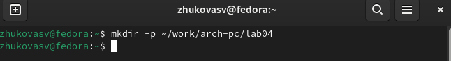{#fie:001 width=70%}

Перейдем в созданный каталог (рис. [-@fie:002]).

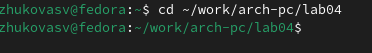{#fie:002 width=70%}

Создадим текстовый файл с именем hello.asm (рис. [-@fie:003]).

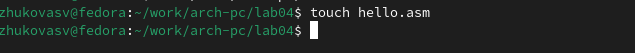{#fie:003width=70%}

Откроем этот файл с помощью текстовоо редактора и ввведем в него следущий текс (рис. [-@fie:004]).

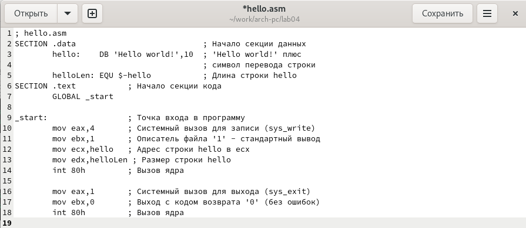{#fie:004 width=70%}

Превратим текст в код (рис. [-@fie:005]).

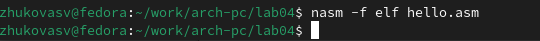{#fie:005 width=70%}

Проверяем создался ли объектный файл (рис. [-@fie:006]).

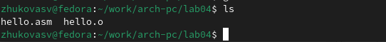{#fie:006 width=70%}

Выполним следующую команду: (рис. [-@fie:007]).

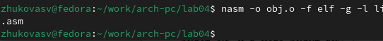{#fie:007 width=70%}

Проверим, что файлы были созданы (рис. [-@fie:008]).

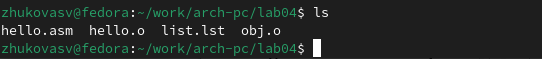{#fie:008 width=70%}

Передаем обЪектный файл на обработку компановщику (рис. [-@fie:009]).

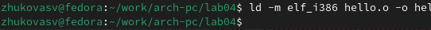{#fie:009 width=70%}

Проверяем создался ли исполняемый файл hello (рис. [-@fie:010]).

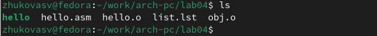{#fie:010 width=70%}

Выпоним следующую команду: (рис. [-@fie:011]).

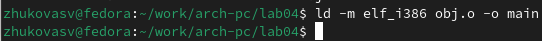{#fie:011 width=70%}

Провeряeм создался ли исполняeмый файл hello (рис. [-@fie:012]).

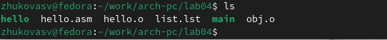{#fie:012 width=70%}

Наберем в командной строке:  (рис. [-@fie:013]).

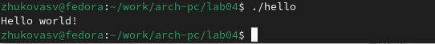{#fie:013 width=70%}

Создаем копи файла hello.asm (рис. [-@fie:014]).

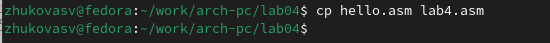{#fie:014 width=70%}

Спомощью тектовоо редактора внесем измнения в текст программы в файе lab4.asm так, чтоы вместо Hello World! на экран выводилась с троа с фамилией и именем 

Открываем и редактируем файл (рис. [-@fie:015]).

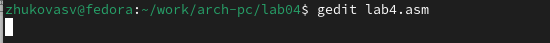{#fie:015 width=70%}

(рис. [-@fie:016]).

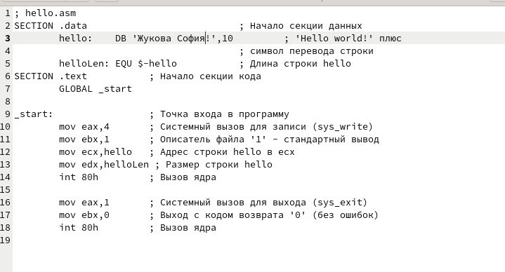{#fie:016 width=70%}

Оттранслируем полученный текст программы  lab4.asm в объектный файл. Выполним компановку объектного файла и запустим получившийся испоняемый файл. (рис. [-@fie:017]).

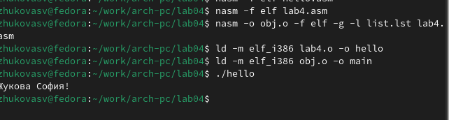{#fie:017 width=70%}

Скопируем файлы hello.asm и labs.asm в наш локальный каталог (рис. [-@fie:018]).

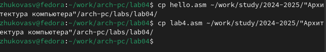{#fie:018 width=70%}

Зарузим файлы на github  (рис. [-@fie:019]).

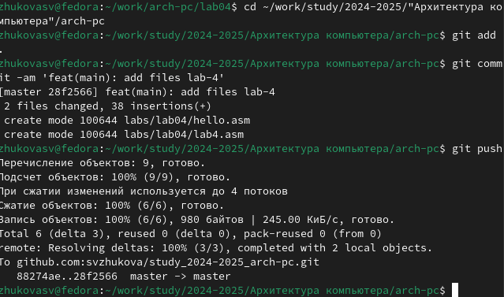{#fie:019 width=70%}

# Выводы

Мы освоили процедуры компиляции и сборки программ, написанных на ассемблере NASM. Создали две программы на языке ассемблер.

