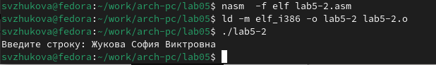
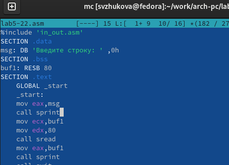

---
\usepackage[utf8]{inputenc}
## Front matter
title: "Отчет по лабораторной работе № 5"
subtitle: "Основы работы с Midnight Commander (mc). Структура программы на языке ассемблера NASM. Системные вызовы в ОС GNU Linux"
author: "Жукова София Викторовна"

## Generic otions
lang: ru-RU

## Bibliography
bibliography: bib/cite.bib
csl: pandoc/csl/gost-r-7-0-5-2008-numeric.csl

## Pdf output format
toc: true # Table of contents
toc-depth: 2
lof: true # List of figures
lot: true # List of tables
fontsize: 12pt
linestretch: 1.5
papersize: a4
documentclass: scrreprt
## I18n polyglossia
polyglossia-lang:
  name: russian
  options:
	- spelling=modern
	- babelshorthands=true
polyglossia-otherlangs:
  name: english
## I18n babel
babel-lang: russian
babel-otherlangs: english
## Fonts
mainfont: IBM Plex Serif
romanfont: IBM Plex Serif
sansfont: IBM Plex Sans
monofont: IBM Plex Mono
mathfont: STIX Two Math
mainfontoptions: Ligatures=Common,Ligatures=TeX,Scale=0.94
romanfontoptions: Ligatures=Common,Ligatures=TeX,Scale=0.94
sansfontoptions: Ligatures=Common,Ligatures=TeX,Scale=MatchLowercase,Scale=0.94
monofontoptions: Scale=MatchLowercase,Scale=0.94,FakeStretch=0.9
mathfontoptions:
## Biblatex
biblatex: true
biblio-style: "gost-numeric"
biblatexoptions:
  - parentracker=true
  - backend=biber
  - hyperref=auto
  - language=auto
  - autolang=other*
  - citestyle=gost-numeric
## Pandoc-crossref LaTeX customization
figureTitle: "Рис."
tableTitle: "Таблица"
listingTitle: "Листинг"
lofTitle: "Список иллюстраций"
lotTitle: "Список таблиц"
lolTitle: "Листинги"
## Misc options
indent: true
header-includes:
  - \usepackage{indentfirst}
  - \usepackage{float} # keep figures where there are in the text
  - \floatplacement{figure}{H} # keep figures where there are in the text
---

# Цель работы

Приобретение практических навыков работы в Midnight Commander. Освоение инструкций языка ассемблера mov и int

# Выполнение лабораторной работы

Откроем Midnight Commander (рис. [-@fig:001]).

{#fig:001 width=70%}

Пользуясь клавишами ↑ , ↓ и Enter перейдем в каталог ~/work/arch-pc созданный при выполнении лабораторной работы №4 (рис. [-@fig:002]).

{#fig:002 width=70%}

С помощью функциональной клавиши F7 создадим папку lab05 (рис. [-@fig:003]).

{#fig:003 width=70%}

Перейдем в созданный каталог (рис. [-@fig:004]).

{#fig:004 width=70%}

Пользуясь строкой ввода и командой touch создадим файл lab5-1.asm (рис. [-@fig:005]).

{#fig:005 width=70%}

С помощью функциональной клавиши F4 откроем файл lab5-1.asm для редактирования во встроенном редакторе. 
Введем текст программы из листинга, сохраним изменения и закроем файл (рис. [-@fig:006]).

{#fig:006 width=70%}

С помощью функциональной клавиши F3 откроем файл lab5-1.asm для просмотра. Убедимся, что файл содержит текст программы. (рис. [-@fig:007]).

{#fig:007 width=70%}

Оттранслируем текст программы lab5-1.asm в объектный файл. Выполним компоновку объектного файла и запуститим получившийся исполняемый файл. (рис. [-@fig:008]).

{#fig:008 width=70%}

Скачиваем файл со страницы курса (рис. [-@fig:009]).

{#fig:009 width=70%}

Копируем файл в нужную директорию (рис. [-@fig:010]).

{#fig:010 width=70%}

С помощью функциональной клавиши F6 создадим копию файла lab5-1.asm с именем lab5-2.asm.  Создаем копию файла клавишей F6 (рис. [-@fig:011]).

{#fig:011 width=70%}

Открываем новый файл и заполняем его в соответствии с листингом (рис. [-@fig:012]).

{#fig:012 width=70%}\

Транслируем и запускаем новый файл (рис. [-@fig:013]).

{#fig:013 width=70%}

Снова открываем файл для редактирования и меняем sprintLF на sprint (рис. [-@fig:014]).

{#fig:014 width=70%}

Транслируем и запускаем файл (рис. [-@fig:015]).

{#fig:015 width=70%}

Можем сделать вывод, что команда sprint выводит текст в той же строке, а sprintLF переносит на новую строку.

**Задание для самостоятельной работы**

Создадим копию файла lab5-1.asm.  (рис. [-@fig:016]).

{#fig:016 width=70%}

Внесем  изменения в программу (без использования внешнего файла in_out.asm), так чтобы она выводила  введённую строку на экран. (рис. [-@fig:017]).

{#fig:017 width=70%}

Транслируем файл и запускаем программу. На приглашение ввести строку введем свою фамилию. (рис. [-@fig:018]).

{#fig:018 width=70%}

Создадим копию файла lab5-2.asm. Исправим текст программы с использование подпрограмм из внешнего файла in_out.asm, так чтобы она выводила введённую строку на экран (рис. [-@fig:019]).
{#fig:019 width=70%}

Транслируем прорамму и проверяем как она работает (рис. [-@fig:020]).

{#fig:020 width=70%}

# Выводы

Мы приобрели практические навыки работы в Midnight Commander. Освоии инструкции языка ассемблера mov и int.

