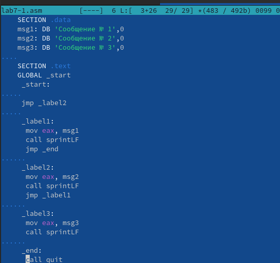
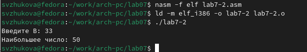
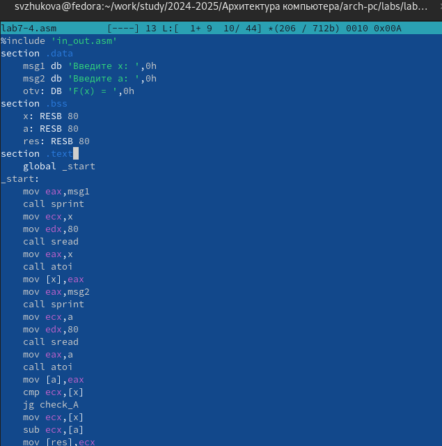

---
## Front matter
title: "Отчет по лабораторной работпе №7"
subtitle: "Команды безусловного и условного переходов в Nasm. Программирование
ветвлений."
author: "Жукова София Виктровна"

## Generic otions
lang: ru-RU
toc-title: "Содержание"

## Bibliography
bibliography: bib/cite.bib
csl: pandoc/csl/gost-r-7-0-5-2008-numeric.csl

## Pdf output format
toc: true # Table of contents
toc-depth: 2
lof: true # List of figures
lot: true # List of tables
fontsize: 12pt
linestretch: 1.5
papersize: a4
documentclass: scrreprt
## I18n polyglossia
polyglossia-lang:
  name: russian
  options:
	- spelling=modern
	- babelshorthands=true
polyglossia-otherlangs:
  name: english
## I18n babel
babel-lang: russian
babel-otherlangs: english
## Fonts
mainfont: IBM Plex Serif
romanfont: IBM Plex Serif
sansfont: IBM Plex Sans
monofont: IBM Plex Mono
mathfont: STIX Two Math
mainfontoptions: Ligatures=Common,Ligatures=TeX,Scale=0.94
romanfontoptions: Ligatures=Common,Ligatures=TeX,Scale=0.94
sansfontoptions: Ligatures=Common,Ligatures=TeX,Scale=MatchLowercase,Scale=0.94
monofontoptions: Scale=MatchLowercase,Scale=0.94,FakeStretch=0.9
mathfontoptions:
## Biblatex
biblatex: true
biblio-style: "gost-numeric"
biblatexoptions:
  - parentracker=true
  - backend=biber
  - hyperref=auto
  - language=auto
  - autolang=other*
  - citestyle=gost-numeric
## Pandoc-crossref LaTeX customization
figureTitle: "Рис."
tableTitle: "Таблица"
listingTitle: "Листинг"
lofTitle: "Список иллюстраций"
lotTitle: "Список таблиц"
lolTitle: "Листинги"
## Misc options
indent: true
header-includes:
  - \usepackage{indentfirst}
  - \usepackage{float} # keep figures where there are in the text
  - \floatplacement{figure}{H} # keep figures where there are in the text
---

# Цель работы

Изучить команды условного и безусловного переходов. Приобрести навыки написания программ с использованием переходов. Познакомиться с назначением и структурой файла листинга.

# Задание

Написать программы для решения системы выражений.

# Выполнение лабораторной работы

**Порядок выполнения лабораторной работы**

**1. Реализация переходов в NASM**
Создадим каталог для программ лабораторной работы № 7, перейдем в него и со-
здадим файл lab7-1.asm (рис. [-@fig:001]).

{#fig:001 width=70%}

Откроем файл lab7-1.asm в Midnight Commander и введем текст программы из листинга 7.1. (рис. [-@fig:002]).

{#fig:002 width=70%}

Создадим исполняемый файл и запустим его. (рис. [-@fig:003]).

{#fig:002 width=70%}

Изменим программу таким образом, чтобы она выводила сначала ‘Сообщение № 2’, потом ‘Сообщение№ 1’ и завершала работу. (рис. [-@fig:004]).

{#fig:004 width=70%}

Создадим исполняемый файл и проверим его работу. (рис. [-@fig:005]).

{#fig:005 width=70%}

Снова открываем файл для редактирования и изменяем его (рис. [-@fig:006]).

{#fig:006 width=70%}

Создаем исполняемый файл и запускаем его (рис. [-@fig:007]).

{#fig:007 width=70%}

Создадим файл lab7-2.asm в каталоге ~/work/arch-pc/lab07. (рис. [-@fig:008]).

{#fig:008 width=70%}

Внимательно изучим текст программы из листинга 7.3 и введем в lab7-2.asm. (рис. [-@fig:009]).

{#fig:009 width=70%}

Создадим исполняемый файл и проверим его работу для разных значений B. (рис. [-@fig:010]).

{#fig:010 width=70%}

(рис. [-@fig:012]).

{#fig:012 width=70%}

**2. Изучение структуры файлы листинга**

Создадим файл листинга для программы из файла lab7-2.asm (рис. [-@fig:011]).

{#fig:011 width=70%}

Открываем файл листинга с помощью команды mcedit (рис. [-@fig:013]).

{#fig:013 width=70%}

Изучаем файл (рис. [-@fig:014]).

{#fig:014 width=70%}

 (рис. [-@fig:015]).

{#fig:015 width=70%}

51: 00000038-адрес в сегменте кода, 50-машинный код, mov eax, 0AH-копируем значение переменой 0АН в eax
52: 00000039-адрес в сегменте кода, 89E0-машинный код, push eax присвоение переменной eax значения 
53: 0000003В-адрес в сегменте кода, E8CFFFFFF-машинный код, call sprint вызывает функцию

Откроем файл с программой lab7-2.asm и в  инструкции с двумя операндами
удалим один операнд. (рис. [-@fig:016]).

{#fig:016 width=70%}

Выполним трансляцию с получением файла листинга: (рис. [-@fig:017]).

{#fig:017 width=70%}

При трансляции файла, выдается ошибка, но создаются исполнительный файл lab7-2 и lab7-2.lst (рис. [-@fig:018]).

{#fig:018 width=70%}

Просматриваем файл листинга (рис. [-@fig:019]).

{#fig:019 width=70%}

**Задание для самостоятельной работы**

ВАРИАНТ 7
1. Напишите программу нахождения наименьшей из 3 целочисленных переменных a,b и c. 
Создадим исполняемый файл (рис. [-@fig:020]).

{#fig:020 width=70%}

Открываем файл и пишем программу, которая выберет наименьшую из трех переменных. (рис. [-@fig:021]).

{#fig:021 width=70%}

Транслируем файл и проверяем программу (рис. [-@fig:022]).

{#fig:022 width=70%}

2. Напишите программу, которая для введенных с клавиатуры значений x и a вычисляет значение заданной функции f(x) и выводит результат вычислений.

Создаем исполняемый файл (рис. [-@fig:023]).

{#fig:023 width=70%}

Заполняем файл (рис. [-@fig:024]).

{#fig:024 width=70%}

Транслируем и проверяем работу файла для разных значений (рис. [-@fig:025]).

{#fig:025 width=70%}

# Выводы

Мы изучили команды условного и безусловного переходов, приобрели навыки написания программ с использованием переходов, познакомились с назначением и структурой файла листинга.

