---
## Front matter
title: "Лабораторная работа №8."
subtitle: "Программирование цикла. Обработка аргументов командной строки."
author: "Жукова София Викторовна"

## Generic otions
lang: ru-RU
toc-title: "Содержание"

## Bibliography
bibliography: bib/cite.bib
csl: pandoc/csl/gost-r-7-0-5-2008-numeric.csl

## Pdf output format
toc: true # Table of contents
toc-depth: 2
lof: true # List of figures
lot: true # List of tables
fontsize: 12pt
linestretch: 1.5
papersize: a4
documentclass: scrreprt
## I18n polyglossia
polyglossia-lang:
  name: russian
  options:
	- spelling=modern
	- babelshorthands=true
polyglossia-otherlangs:
  name: english
## I18n babel
babel-lang: russian
babel-otherlangs: english
## Fonts
mainfont: IBM Plex Serif
romanfont: IBM Plex Serif
sansfont: IBM Plex Sans
monofont: IBM Plex Mono
mathfont: STIX Two Math
mainfontoptions: Ligatures=Common,Ligatures=TeX,Scale=0.94
romanfontoptions: Ligatures=Common,Ligatures=TeX,Scale=0.94
sansfontoptions: Ligatures=Common,Ligatures=TeX,Scale=MatchLowercase,Scale=0.94
monofontoptions: Scale=MatchLowercase,Scale=0.94,FakeStretch=0.9
mathfontoptions:
## Biblatex
biblatex: true
biblio-style: "gost-numeric"
biblatexoptions:
  - parentracker=true
  - backend=biber
  - hyperref=auto
  - language=auto
  - autolang=other*
  - citestyle=gost-numeric
## Pandoc-crossref LaTeX customization
figureTitle: "Рис."
tableTitle: "Таблица"
listingTitle: "Листинг"
lofTitle: "Список иллюстраций"
lotTitle: "Список таблиц"
lolTitle: "Листинги"
## Misc options
indent: true
header-includes:
  - \usepackage{indentfirst}
  - \usepackage{float} # keep figures where there are in the text
  - \floatplacement{figure}{H} # keep figures where there are in the text
---

# Цель работы

Приобретение навыков написания программ с использованием циклов и обработкой
аргументов командной строки.

# Задание

Написать программы с использованием циклов и обработкой аргументов командной строки.

# Выполнение лабораторной работы

**1. Реализация циклов в NASM**
Создадим каталог для программам лабораторной работы № 8, перейдем в него и создадим файл lab8-1.asm: (рис. [-@fig:001]).

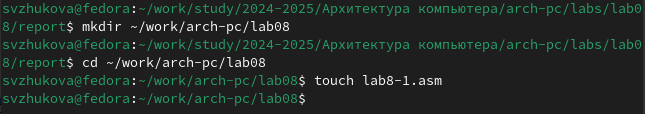{#fig:001 width=70%}

Откроем файл в Midnight Commander и введем в файл lab8-1.asm текст программы из листинга 8.1. (рис. [-@fig:002]).

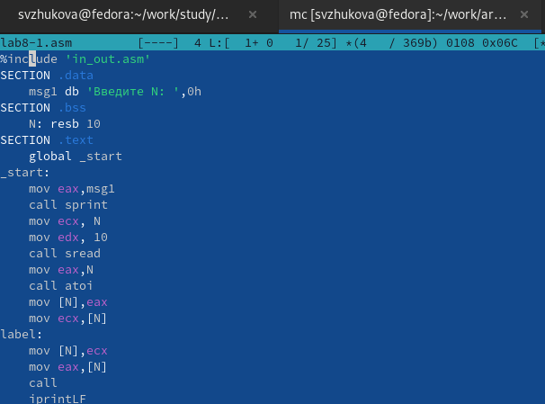{#fig:002 width=70%}

Создадим исполняемый файл и проверим его работу. (рис. [-@fig:003]).

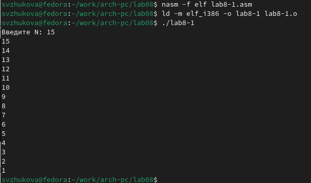{#fig:003 width=70%}

Изменим текст программы добавив изменение значение регистра ecx в цикле: (рис. [-@fig:004]).

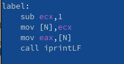{#fig:004 width=70%}

Создаем исполняемый файл и запускаем его  (рис. [-@fig:005]).

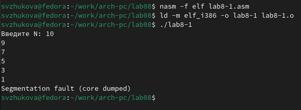{#fig:005 width=70%}

Регистр ecx принимает значения 9,7,5,3,1(на вход подается число 10, в цикле label данный регистр уменьшается на 2 командой sub и loop и выводятся тоько нечетные числа).
Число проходов цикла не соответсвует числу N, так как уменьшается на 2.

Снова открываем файл для редактирования и изменяем его, чтобы все корректно работало  (рис. [-@fig:006]).

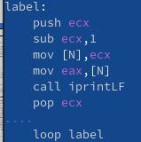{#fig:006 width=70%}

Создадим исполняемый файл и проверим его работу. (рис. [-@fig:007]).

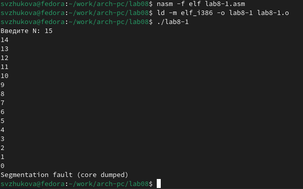{#fig:007 width=70%}

Число проходов цикла соответствует значению N введенному с клавиатуры.

**2. Обработка аргументов командной строки**

Создаем файл lab8-2.asm в каталоге ~/work/arch-pc/lab08 (рис. [-@fig:008]).

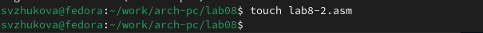{#fig:008 width=70%}

Введим в него текст программы из листинга 8.2. (рис. [-@fig:009])

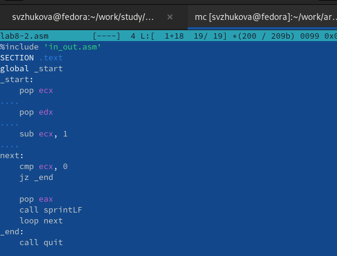{#fig:009 width=70%}

Создадим исполняемый файл и запустим его, указав аргументы: (рис. [-@fig:010]).

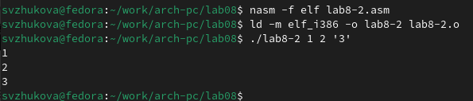{#fig:010 width=70%}

Програмой было обработано 3 аргумента.

Создадим файл lab8-3.asm в каталоге ~/work/arch-pc/lab08 (рис. [-@fig:011]).

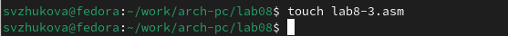{#fig:011 width=70%}

Введем в него текст программы из листинга 8.3. (рис. [-@fig:012]).

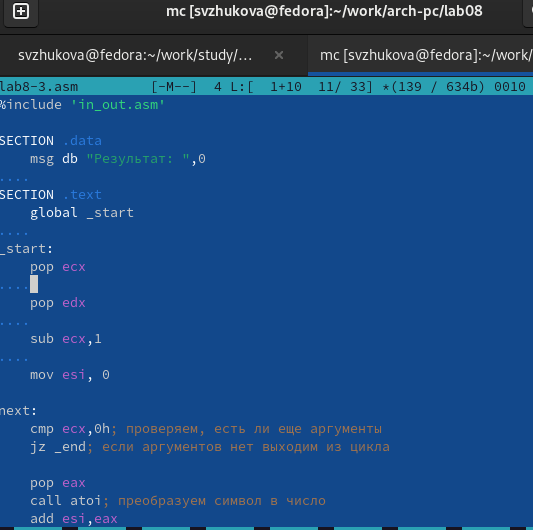{#fig:012 width=70%}

Создаём исполняемый файл и запускаем его, указав аргументы (рис. [-@fig:013]).

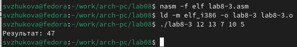{#fig:013 width=70%}

Изменим текст программы из листинга 8.3 для вычисления произведения аргументов
командной строки. (рис. [-@fig:014].

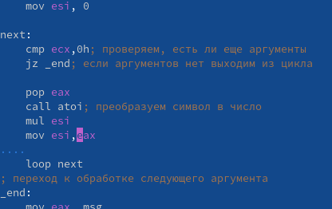{#fig:014 width=70%}

Создаём исполняемый файл и запускаем его, указав аргументы (рис. [-@fig:015]).

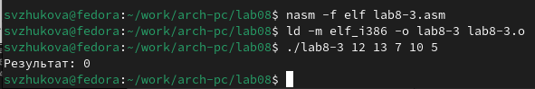{#fig:015 width=70%}

**4. Задание для самостоятельной работы**

ВАРИАНТ 7

1. Напишите программу, которая находит сумму значений функции F(X) для
x=x1,x2 ..., xn , т.е. программа должна выводить значение f(x1) + f(x1) + ... + f(xn). 
Создадим исполняемый файл и проверим его работу на нескольких наборах x=x1,x2 ..., xn 

Создаем файл lab8-4.asm (рис. [-@fig:016]).

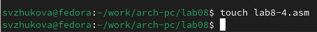{#fig:016 width=70%}

Открываем файл и пишем программу, которая выведет сумму значений, получившихся после решения выражения 3(x+2) (рис. [-@fig:017]).

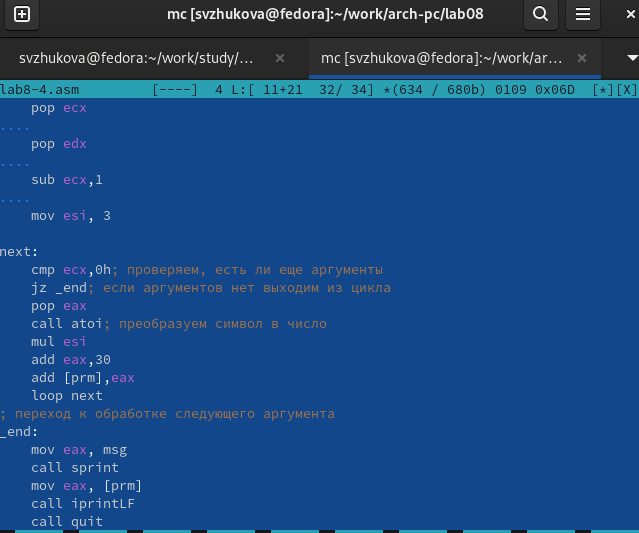{#fig:017 width=70%}

Транслируем файл и смотрим на работу программы (рис. [-@fig:018]).

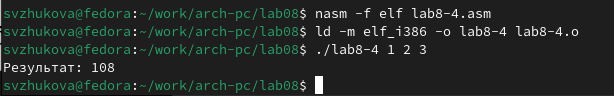{#fig:018 width=70%}

Транслируем файл и смотрим на работу программы (рис. [-@fig:019]).

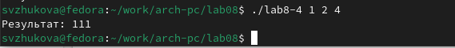{#fig:019 width=70%}

# Выводы

Мы приобреи навыки написания программ с использованием циклов и обработкой
аргументов командной строки.
