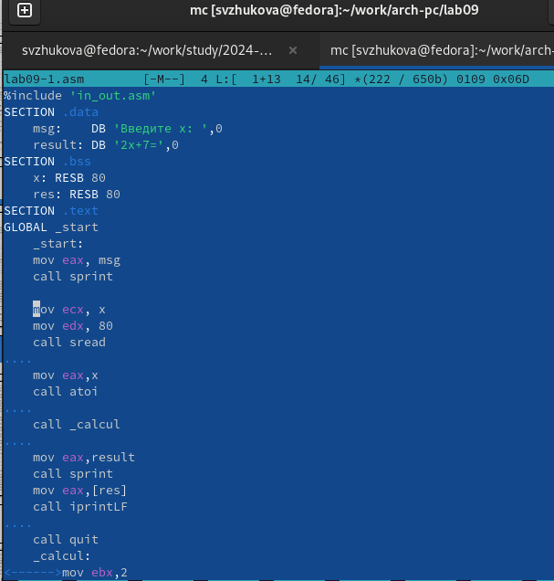
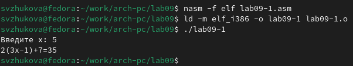
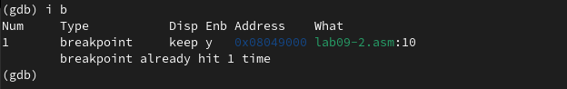
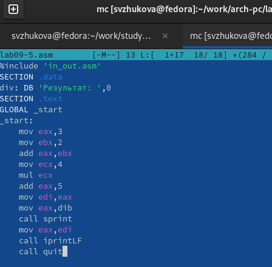

---
## Front matter
title: "Лабораторная работа №9."
subtitle: "Понятие подпрограммы. Отладчик GDB."
author: "Жукова София Викторвна"

## Generic otions
lang: ru-RU
toc-title: "Содержание"

## Bibliography
bibliography: bib/cite.bib
csl: pandoc/csl/gost-r-7-0-5-2008-numeric.csl

## Pdf output format
toc: true # Table of contents
toc-depth: 2
lof: true # List of figures
lot: true # List of tables
fontsize: 12pt
linestretch: 1.5
papersize: a4
documentclass: scrreprt
## I18n polyglossia
polyglossia-lang:
  name: russian
  options:
	- spelling=modern
	- babelshorthands=true
polyglossia-otherlangs:
  name: english
## I18n babel
babel-lang: russian
babel-otherlangs: english
## Fonts
mainfont: IBM Plex Serif
romanfont: IBM Plex Serif
sansfont: IBM Plex Sans
monofont: IBM Plex Mono
mathfont: STIX Two Math
mainfontoptions: Ligatures=Common,Ligatures=TeX,Scale=0.94
romanfontoptions: Ligatures=Common,Ligatures=TeX,Scale=0.94
sansfontoptions: Ligatures=Common,Ligatures=TeX,Scale=MatchLowercase,Scale=0.94
monofontoptions: Scale=MatchLowercase,Scale=0.94,FakeStretch=0.9
mathfontoptions:
## Biblatex
biblatex: true
biblio-style: "gost-numeric"
biblatexoptions:
  - parentracker=true
  - backend=biber
  - hyperref=auto
  - language=auto
  - autolang=other*
  - citestyle=gost-numeric
## Pandoc-crossref LaTeX customization
figureTitle: "Рис."
tableTitle: "Таблица"
listingTitle: "Листинг"
lofTitle: "Список иллюстраций"
lotTitle: "Список таблиц"
lolTitle: "Листинги"
## Misc options
indent: true
header-includes:
  - \usepackage{indentfirst}
  - \usepackage{float} # keep figures where there are in the text
  - \floatplacement{figure}{H} # keep figures where there are in the text
---

# Цель работы

Приобретение навыков написания программ с использованием подпрограмм. Знакомство с методами отладки при помощи GDB и его основными возможностями.

# Выполнение лабораторной работы

**1. Реализация подпрограмм в NASM**

Создадим каталог для выполнения лабораторной работы № 9, перейдем в него и со-
здадим файл lab09-1.asm: (рис. [-@fig:001]).

{#fig:001 width=70%}

Открываем файл в Midnight Commander и заполняем его в соответствии с
листингом 9.1 (рис. [-@fig:002]).

{#fig:002 width=70%}

Создаем исполняемый файл и запускаем его (рис. [-@fig:003]).

{#fig:003 width=70%}

Снова открываем файл для редактирования и изменяем его, добавив подпрограмму в подпрограмму (рис. [-@fig:004]).

{#fig:004 width=70%}

Создаем исполняемый файл и запускаем его (рис. @fig:005).

{#fig:005 width=70%}

## Отладка программам с помощью GDB

Создаем новый файл в каталоге(рис. @fig:006).

{#fig:006 width=70%}

Открываем файл в Midnight Commander и заполняем его в соответствии с листингом 9.2 (рис. @fig:007).

{#fig:007 width=70%}

Получаем исходный файл с использованием отладчика gdb (рис. @fig:008).

{#fig:008 width=70%}

Запускаем команду в отладчике (рис. @fig:009).

{#fig:009 width=70%}

Устанавливаем брейкпоинт на метку _start и запускаем программу (рис. @fig:010).

{#fig:010 width=70%}

Смотрим дисассимилированный код программы с помощью команды disassemble, начиная с метки _start(рис. @fig:011).

{#fig:011 width=70%}

Переключаемся на отображение команд с Intel’овским синтаксисом (рис. @fig:012).

{#fig:012 width=70%}

Различия отображения синтаксиса машинных команд в режимах ATT и Intel:

1.Порядок операндов: В ATT синтаксисе порядок операндов обратный, сначала указывается исходный операнд, а затем - результирующий операнд. В Intel синтаксисе порядок обычно прямой, результирующий операнд указывается первым, а исходный - вторым.

2.Разделители: В ATT синтаксисе разделители операндов - запятые. В Intel синтаксисе разделители могут быть запятые или косые черты (/).

3.Префиксы размера операндов: В ATT синтаксисе размер операнда указывается перед операндом с использованием префиксов, таких как "b" (byte), "w" (word), "l" (long) и "q" (quadword). В Intel синтаксисе размер операнда указывается после операнда с использованием суффиксов, таких как "b", "w", "d" и "q".

4.Знак операндов: В ATT синтаксисе операнды с позитивными значениями предваряются символом "$". В Intel синтаксисе операнды с позитивными значениями могут быть указаны без символа "$".

5.Обозначение адресов: В ATT синтаксисе адреса указываются в круглых скобках. В Intel синтаксисе адреса указываются без скобок.

6.Обозначение регистров: В ATT синтаксисе обозначение регистра начинается с символа "%". В Intel синтаксисе обозначение регистра может начинаться с символа "R" или "E" (например, "%eax" или "RAX").

Включаем режим псевдографики (рис. @fig:013).

{#fig:013 width=70%}

Проверяем была ли установлена точка останова и устанавливаем точку останова предпоследней инструкции (рис. @fig:014).

{#fig:014 width=70%}

Посмотрим информацию о всех установленных точках останова (рис. @fig:015).

{#fig:015 width=70%}

Выполняем 5 инструкций командой si  (рис. @fig:016).

{#fig:016 width=70%}

Во время выполнения команд менялись регистры: ebx, ecx, edx,eax, eip.

Смотрим значение переменной msg1 по имени (рис. @fig:017).

{#fig:017 width=70%}

Смотрим значение переменной msg2 по адресу (рис. @fig:018).

{#fig:018 width=70%}

Изменим первый символ переменной msg1 (рис. @fig:019).

{#fig:019 width=70%}

Изменим первый символ переменной msg2 (рис. @fig:020).

{#fig:020 width=70%}

Смотрим значение регистра edx в разных форматах (рис. @fig:021).

{#fig:021 width=70%}

Изменяем регистор ebx (рис. @fig:022).

{#fig:022 width=70%}

Выводится разные значения, так как команда без кеавычек присваивает регистру вводимое значение.

Прописываем команды для завершения программы и выхода из GDB (рис. @fig:023).

{#fig:023 width=70%}

**3. Обработка аргументов командной строки в GDB**

Копируем файл lab8-2.asm в файл с именем lab09-3.asm (рис. @fig:024).

{#fig:024 width=70%}

Создаем исполняемый файл и запускаем его в отладчике GDB (рис. @fig:025).

{#fig:025 width=70%}

Установим точку останова перед первой инструкцией в программе и запустим ее (рис. @fig:026).

{#fig:026 width=70%}

Смотрим позиции стека по разным адресам (рис. @fig:027).

{#fig:027 width=70%}

Шаг изменения адреса равен 4 потому что адресные регистры имеют размерность 32 бита(4 байта).

##Задание для самостоятельной работы

**Задание 1**

Копируем файл lab8-4.asm(ср №1 в ЛБ8) в файл с именем lab09-3.asm (рис. @fig:028).

{#fig:028 width=70%}

Открываем файл в Midnight Commander и меняем его, создавая подпрограмму (рис. @fig:029).

{#fig:029 width=70%}

Создаем исполняемый файл и запускаем его (рис. @fig:030).

{#fig:030 width=70%}

###Задание 2

Создаем новый файл в дирректории (рис. @fig:031).

{#fig:031 width=70%}

Открываем файл в Midnight Commander и заполняем его в соответствии с листингом 9.3 (рис. @fig:032).

{#fig:032 width=70%}

Создаем исполняемый файл и запускаем его (рис. @fig:033).

{#fig:033 width=70%}

Создаем исполняемый файл и запускаем его в отладчике GDB и смотрим на изменение решистров командой si (рис. @fig:034).

{#fig:034 width=70%}

Изменяем программу для корректной работы (рис. @fig:035).

{#fig:035 width=70%}

Создаем исполняемый файл и запускаем его (рис. @fig:036).

{#fig:036 width=70%}

# Выводы

Мы приобрели навыки написания программ с использованием подпрограмм. Познакомились с методами отладки при помощи GDB и его основными возможностями.

